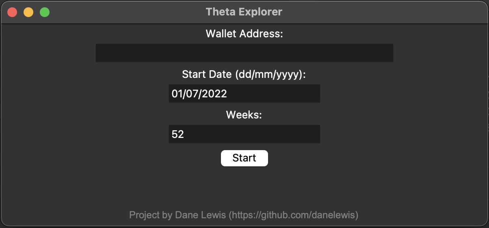

# Theta Transactions
The Theta Blockchain explorer only allows 7 days worth of transactions to be downloaded as csv at a time. As many wallet-holders require 12 months of history at tax time, this 7 day restriction means you need to download 52 files and manually combine them.

To solve this, I have written a python app that downloads up to 52 weeks (one year) worth of transactions for a given wallet address, and combines the CSV files into a single file in less than a minute.

I have also created executables for MacOS and Windows (.app and .exe) using Pyinstaller. Please note, these executables are currently unsigned, so are likely to set off antivirus and OS protections, and may take a few seconds to launch due to the nature of Pyinstaller packages - double click and be patient

## How to Use
Launch the app - be patient after double clicking

* **Wallet Address**: Enter the wallet address here.
	* The address will be verified before the script runs
* **Start Date**: Enter the first date you need data for
* **Weeks**: Enter the number of weeks you need.
	* Default is 52 weeks (1 year)
	* Maximum is 52 weeks so as avoid accidental spamming of the API
* **Start**: Click to start the download
	* You will be asked where to save the file once start is pressed

The program typically takes 30 seconds or so to run for 52 weeks, but will be dependant on your internet connection and computer.
